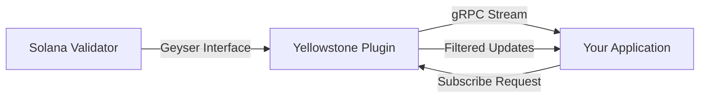

## Welcome to Yellowstone gRPC

Yellowstone Dragon's Mouth is a high-performance gRPC interface for Solana, built around the Geyser plugin framework. It provides real-time streaming of blockchain data including accounts, transactions, blocks, and slots through a standardized gRPC API.

<CardGroup cols={2}>
  <Card title="Quick Start" icon="rocket" href="/quickstart">
    Get up and running with Yellowstone gRPC in minutes
  </Card>
  <Card title="Architecture" icon="diagram-project" href="/architecture">
    Understand how Yellowstone gRPC works
  </Card>
  <Card title="Geyser Plugin" icon="plug" href="/plugin/installation">
    Deploy the plugin to your Solana validator
  </Card>
  <Card title="Client SDKs" icon="code" href="/clients/overview">
    Connect using Rust, TypeScript, or other languages
  </Card>
</CardGroup>

## Key Features

<CardGroup cols={2}>
  <Card title="Real-time Streaming" icon="signal-stream">
    Stream accounts, transactions, blocks, and slots as they happen on the Solana blockchain
  </Card>
  <Card title="Advanced Filtering" icon="filter">
    Filter data by account, owner, transaction signature, and custom memcmp conditions
  </Card>
  <Card title="High Performance" icon="gauge-high">
    Built with gRPC for low latency and high throughput, with support for compression
  </Card>
  <Card title="Multiple SDKs" icon="laptop-code">
    Official Rust and TypeScript clients, plus examples for Go and Python
  </Card>
  <Card title="Block Reconstruction" icon="cubes">
    Get complete blocks with detailed transaction and account update information
  </Card>
  <Card title="Monitoring" icon="chart-line">
    Prometheus metrics for observability and performance tuning
  </Card>
</CardGroup>

## What is Geyser?

Geyser is Solana's plugin interface that allows validators to stream account updates, transaction data, and block information in real-time. Yellowstone gRPC implements a Geyser plugin that exposes this data through a gRPC API, making it accessible to external applications.

## Use Cases

<AccordionGroup>
  <Accordion title="Real-time Account Monitoring">
    Monitor specific Solana accounts for balance changes, data updates, or ownership transfers. Perfect for tracking token accounts, program state, or NFT collections.
  </Accordion>
  <Accordion title="Transaction Indexing">
    Build custom transaction indexers that process Solana transactions in real-time. Filter by program IDs, account involvement, or transaction signatures.
  </Accordion>
  <Accordion title="Block Explorers">
    Power block explorers and analytics platforms with comprehensive block data including all transactions, account updates, and metadata.
  </Accordion>
  <Accordion title="DeFi Applications">
    Stream price feeds, liquidity pool updates, and trading activity for decentralized finance applications.
  </Accordion>
  <Accordion title="NFT Platforms">
    Track NFT mints, transfers, and marketplace activity across Solana NFT programs.
  </Accordion>
</AccordionGroup>

## How It Works

1. The Yellowstone gRPC plugin loads into a Solana validator via the Geyser interface
2. Your application connects to the gRPC server and sends subscription requests with filters
3. The plugin streams real-time updates matching your filters
4. Your application processes the updates as they arrive

## Getting Started

<Steps>
  <Step title="Choose Your Path">
    Decide whether you want to deploy the Geyser plugin or connect to an existing endpoint
  </Step>
  <Step title="Install a Client SDK">
    Use the Rust or TypeScript client, or connect with any gRPC-compatible library
  </Step>
  <Step title="Subscribe to Data">
    Configure filters to receive only the data you need
  </Step>
  <Step title="Process Updates">
    Handle incoming account, transaction, block, and slot updates in your application
  </Step>
</Steps>

<Card title="Ready to start?" icon="play" href="/quickstart">
  Follow our quickstart guide to connect to Yellowstone gRPC
</Card>

## Community and Support

Yellowstone gRPC is built and maintained by [Triton One](https://triton.one). For additional documentation and support:

- **GitHub**: [rpcpool/yellowstone-grpc](https://github.com/rpcpool/yellowstone-grpc)
- **Official Docs**: [docs.triton.one](https://docs.triton.one/rpc-pool/grpc-subscriptions)
- **Issues**: Report bugs and request features on [GitHub Issues](https://github.com/rpcpool/yellowstone-grpc/issues)
